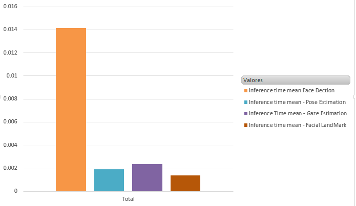

# Computer Pointer Controller

Computer Pointer Controller is a computer vision application that runs Gaze estimation to manage the movement of the pointer. The Gaze estimation model requires input from three models:

- Face Detection: return a list with bounding boxes and their probability of the box containing a face.
- Facial LandMark detection: detects the coordinates of facial landmarks.
- Head Pose Estimation: whose output is the yaw, pitch and roll angles.


## Project Set Up and Installation

### Project Structure
```bash
.
├── _bin
|   ├── demo.mp4
├── _models
|   ├── all the requires models
├── _result
|   ├── videos of the executions
├── _src
|   ├── input_feeder.py
|   ├── mouse_controller.py
|   ├── face_detection.py
|   ├── facial_landmark_detection.py
|   ├── head_pose_estimation.py
|   ├── gaze_estimation.py
├── _util
|   ├── cast_argument.py
├── _main_script.py
├── _README.md
├── requirements.txt
```

### Language setting
| Details            |              |
|-----------------------|---------------|
| Programming Language: |  Python 3.5 or 3.6 |

### Hardware

* 6th to 10th generation Intel® Core™ processor with Iris® Pro graphics or Intel® HD Graphics.


### Installation of openvino

- Install openvino on [Windows](https://docs.openvinotoolkit.org/latest/openvino_docs_install_guides_installing_openvino_windows.html)


#### Set up a environment
- Create and environment with Conda:

```console
conda create --name openvino_env

activate openvino_env
```


- install requirements:
Go into the main directory and run, the requirements file
```console
pip3 install -r requirements.txt
```


#### Run setupvars.bat
```console
> cd C:\Program Files (x86)\IntelSWTools\openvino_2020.4.287\bin

> setupvars.bat
```

### Download Models
You can download all the models using the [Model Downloader](https://docs.openvinotoolkit.org/latest/omz_tools_downloader_README.html).

#### Arguments:
- name: name of the model to download, for more [information](https://docs.openvinotoolkit.org/latest/usergroup4.html) 
- precisions: you can download the model in different precisions.
- o: The folder output where the model should be stored.


#### Landmark detection
```console
(openvino_env) C:\Program Files (x86)\IntelSWTools\openvino_2020.4.287\deployment_tools\open_model_zoo\tools\downloader>python3 downloader.py --name face-detection-adas-binary-0001 --precisions FP16 -o C:\Users\VoxivaAI\Desktop\workspace_gustavo\github\computer_point_controller\models\intel
```

#### Face detection
```console
(openvino_env) C:\Program Files (x86)\IntelSWTools\openvino_2020.4.287\deployment_tools\open_model_zoo\tools\downloader>python3 downloader.py --name face-detection-adas-binary-0001 --precisions FP16 -o C:\Users\VoxivaAI\Desktop\workspace_gustavo\github\computer_point_controller\models\intel
```

#### Head pose estimation
```console
(openvino_env) C:\Program Files (x86)\IntelSWTools\openvino_2020.4.287\deployment_tools\open_model_zoo\tools\downloader>python3 downloader.py --name head-pose-estimation-adas-0001 --precisions FP16 -o C:\Users\VoxivaAI\Desktop\workspace_gustavo\github\computer_point_controller\models
```

#### Gaze estimation
```console
(openvino_env) C:\Program Files (x86)\IntelSWTools\openvino_2020.4.287\deployment_tools\open_model_zoo\tools\downloader>python3 downloader.py --name gaze-estimation-adas-0002 --precisions FP16 -o C:\Users\VoxivaAI\Desktop\workspace_gustavo\github\computer_point_controller\models
```


## Demo
Activate openvino variables
On the terminal run activate your virtual env:

```console
C:\> activate openvino_env
```

Run setupvars, which is located in the following path for Windows:
```console
cd C:\Program Files (x86)\IntelSWTools\openvino_2020.4.287\bin

(openvino_env) C:\Program Files (x86)\IntelSWTools\openvino_2020.4.287\bin>setupvars.bat
```

### Run main_script
Now that openvino environment and setupvars are configure, we can run our main script.


#### Run on CPU
```console
(openvino_env) python main_script.py  --fc_model models/intel/face-detection-adas-binary-0001/FP32-INT1/face-detection-adas-binary-0001   --hp_model models/intel/head-pose-estimation-adas-0001/FP16/head-pose-estimation-adas-0001  --fl_model models/intel/landmarks-regression-retail-0009/FP16/landmarks-regression-retail-0009 --ge_model models/intel/gaze-estimation-adas-0002/FP16/gaze-estimation-adas-0002  --device CPU --input_type video  --output_path result/  --fc_output 1  --hp_output 1 --fl_output  1 --ge_output 1 --show_image 0
```


## Documentation
Arguments for main_script:


```
usage: main_script.py [-h] --fc_model FC_MODEL [--fc_output FC_OUTPUT]      
                      --hp_model HP_MODEL [--hp_output HP_OUTPUT] --fl_model
                      FL_MODEL [--fl_output FL_OUTPUT] --ge_model GE_MODEL  
                      [--ge_output GE_OUTPUT] [--device {CPU,GPU,MYRIAD,FPGA}]
                      [--input_type {video,cam,image}]
                      [--input_file INPUT_FILE] [--output_path OUTPUT_PATH]
                      [--show_image SHOW_IMAGE]

optional arguments:
  -h, --help            show this help message and exit
  --fc_model FC_MODEL   Face Detection model folder
  --fc_output FC_OUTPUT
                        Generate output of Face Detection
  --hp_model HP_MODEL   Head Pose Estimation model folder
  --hp_output HP_OUTPUT
                        Generate output of Head Pose Estimation
  --fl_model FL_MODEL   Facial Landmark Detection model folder
  --fl_output FL_OUTPUT
                        Generate output of Facial Landmark Detection
  --ge_model GE_MODEL   Gaze Estimation model folder
  --ge_output GE_OUTPUT
                        Generate output of Gaze Estimation
  --device {CPU,GPU,MYRIAD,FPGA}
                        Specify the device to run the inference CPU, GPU,
                        FPGA, MYRIAD
  --input_type {video,cam,image}
                        type of input file could be video file or streaming
                        from a camera
  --input_file INPUT_FILE
                        path of the video file
  --output_path OUTPUT_PATH
                        path to store the results
  --show_image SHOW_IMAGE
                        show the frames on the screen

```

## Benchmarks
Sum of inference time for each model.


Average inference time in CPU for each model.


Average inference time in GPU (low capacity) for each model.



---

### Model size
The size of the model pre- and post-conversion was...
| |face-detection-adas-binary-0001|head-pose-estimation-adas-0001|landmarks-regression-retail-0009|gaze-estimation-adas-0002|
|-|-|-|-|-|
|BIN|1.7 MB|3.7 MB|373 KB|3.6 MB|
|XML|114 KB|50 KB|42 KB|65 KB|
|PRECISION|FP32|FP16|FP16|FP16|


## Results and next steps
* The Face detection takes most of the time to infer it might be the bottleneck due to it requires iterate over each bounding box to check if it exceeds the threshold.
* Although, Gaze detection have several process and inputs it only takes 0.001 seconds in average.
* Only CPU and GPU were tested due to the lack of components available.
* GPU shows a increment in the inference time in comparison with CPU which was two times faster. More over, GPU takes more time loading each model which, this issue can be a problem if the systems needs to reset from time to time.
* It's necessary optimize the bottleneck using VTune.


## Edge Cases
In the near future the project will be tested on other devices like the NCS2.
